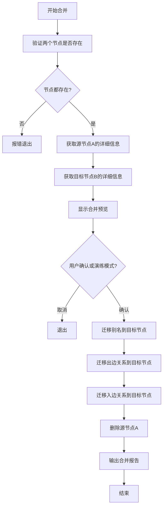

# Dgraph 节点合并功能实现计划

## 1. 功能概述

在 `cmd/tools/dgraph/clear.go` 中添加节点合并功能，将源节点 A 合并到目标节点 B。

### 合并操作流程



## 2. 合并操作详细步骤

### 2.1 别名迁移
- 将源节点 A 的所有 `aliases` 添加到目标节点 B
- 使用 map 去重，避免重复别名

### 2.2 出边迁移
- 查询源节点 A 的所有出边（A -> predicate -> target）
- 为目标节点 B 创建相同的出边（B -> predicate -> target）
- 删除源节点 A 的出边

### 2.3 入边迁移
- 查询源节点 A 的所有入边（source -> predicate -> A）
- 为目标节点 B 创建相同的入边（source -> predicate -> B）
- 删除指向源节点 A 的入边

### 2.4 删除源节点
- 删除源节点 A 本身

## 3. 数据结构设计

```go
// MergeRequest 合并请求
type MergeRequest struct {
    SourceUID string // 源节点 UID（将被合并删除）
    TargetUID string // 目标节点 UID（将保留）
}

// MergeReport 合并报告
type MergeReport struct {
    SourceUID       string
    TargetUID       string
    AliasesMigrated int    // 迁移的别名数量
    OutEdgesMigrated int   // 迁移的出边数量
    InEdgesMigrated  int   // 迁移的入边数量
    Success          bool
    Error            string
}

// NodeInfo 节点信息
type NodeInfo struct {
    UID        string
    Name       string
    Type       string
    Aliases    []string
    OutEdges   []EdgeInfo // 出边
    InEdges    []EdgeInfo // 入边
}

// EdgeInfo 边信息
type EdgeInfo struct {
    Predicate string
    TargetUID string
    SourceUID string
}
```

## 4. 命令行参数设计

```bash
# 合并两个节点（演练模式）
go run clear.go -addr=localhost:9080 -merge -source=0x8d6 -target=0x493 -dry-run=true

# 执行实际合并
go run clear.go -addr=localhost:9080 -merge -source=0x8d6 -target=0x493 -dry-run=false
```

新增参数：
- `-merge`: 启用合并模式
- `-source`: 源节点 UID（将被合并删除）
- `-target`: 目标节点 UID（将保留）

## 5. 核心方法设计

### 5.1 MergeNodes 方法

```go
// MergeNodes 将源节点合并到目标节点
func (c *DgraphCleaner) MergeNodes(sourceUID, targetUID string) (*MergeReport, error)
```

### 5.2 辅助方法

```go
// getNodeInfo 获取节点详细信息（包括入边和出边）
func (c *DgraphCleaner) getNodeInfo(uid string) (*NodeInfo, error)

// migrateAliases 迁移别名
func (c *DgraphCleaner) migrateAliases(source, target *NodeInfo) error

// migrateOutEdges 迁移出边
func (c *DgraphCleaner) migrateOutEdges(source, target *NodeInfo) error

// migrateInEdges 迁移入边
func (c *DgraphCleaner) migrateInEdges(source, target *NodeInfo) error

// deleteNode 删除节点
func (c *DgraphCleaner) deleteNode(uid string) error
```

## 6. DQL 查询设计

### 6.1 获取节点详细信息

```dql
{
  q(func: uid($uid)) {
    uid
    name
    dgraph.type
    aliases
    expand(_all_) {
      uid
      name
    }
  }
}
```

### 6.2 获取入边

```dql
{
  q(func: uid($uid)) {
    uid
    name
    ~* {
      uid
      name
    }
  }
}
```

## 7. 实现步骤

### 步骤 1: 添加数据结构
- 在 `clear.go` 中添加 `MergeRequest`, `MergeReport`, `NodeInfo`, `EdgeInfo` 结构体

### 步骤 2: 添加命令行参数
- 添加 `-merge`, `-source`, `-target` 参数

### 步骤 3: 实现 getNodeInfo 方法
- 查询节点的详细信息
- 包括名称、类型、别名、出边、入边

### 步骤 4: 实现 migrateAliases 方法
- 合并别名到目标节点
- 使用 map 去重

### 步骤 5: 实现 migrateOutEdges 方法
- 获取源节点的所有出边
- 为目标节点创建相同的出边
- 删除源节点的出边

### 步骤 6: 实现 migrateInEdges 方法
- 获取源节点的所有入边
- 将入边重定向到目标节点
- 删除指向源节点的入边

### 步骤 7: 实现 deleteNode 方法
- 删除源节点

### 步骤 8: 实现 MergeNodes 主方法
- 整合所有步骤
- 支持演练模式
- 生成合并报告

### 步骤 9: 更新 main 函数
- 根据参数选择执行清洗或合并功能

## 8. 错误处理

- 源节点或目标节点不存在
- 源节点和目标节点相同
- 合并过程中事务失败
- 网络连接问题

## 9. 测试场景

1. 正常合并流程测试
2. 演练模式测试（不实际执行）
3. 节点不存在的情况
4. 相同节点合并的情况
5. 空别名节点的合并
6. 大量边的节点合并

## 10. 注意事项

1. 合并操作不可逆，建议先使用演练模式确认
2. 大量边的节点可能需要分批处理
3. 需要考虑并发安全，避免同时合并同一节点
